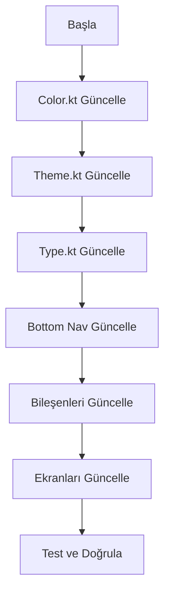

# Binance Tarzı UI Dönüşüm Planı

## Genel Bakış
Bu plan, Fontakip uygulamasını Binance tarzı modern fintech UI'ye dönüştürmek için hazırlanmıştır.

## Hedef Tasarım
- **Ana Arka Plan**: #000000 (Tam siyah)
- **Kart Arka Plan**: #121212 (Hafif mat koyu gri)
- **Binance Sarı**: #F0B90B (Ana vurgu rengi)
- **Altın Sarısı**: #FFE082 (Yumuşak vurgular)
- **Canlı Yeşil**: #10C020 (Kâr göstergesi)
- **Mercan Kırmızısı**: #FF4D4D (Zarar göstergesi)
- **Beyaz**: #FFFFFF (Kritik sayısal veriler)

## Uygulama Adımları

### 1. Color.kt Güncellemeleri
- [ ] Yeni Binance renk sabitleri ekle
- [ ] Koyu arka plan renkleri güncelle
- [ ] Status (kâr/zarar) renklerini güncelle
- [ ] Tema renklerini yeniden düzenle

### 2. Theme.kt Güncellemeleri
- [ ] BinanceDarkColorScheme oluştur
- [ ] getThemeColors fonksiyonlarını güncelle
- [ ] Status bar / navigation bar renklerini ayarla
- [ ] AppTheme enum'una BINANCE_DARK ekle

### 3. Type.kt Güncellemeleri
- [ ] Metin renklerini yeni temayla uyumlu hale getir
- [ ] Binance sarısını başlıklarda kullan
- [ ] Beyazı kritik verilerde kullan

### 4. Bottom Navigation Güncellemeleri
- [ ] Binance tarzı kavisli tasarım
- [ ] Sarı vurgulu aktif ikon
- [ ] Koyu arka plan (#14151C)

### 5. Bileşen Güncellemeleri
- [ ] PortfolioSummaryCard - yeni renklerle
- [ ] AssetCard - yeni renklerle
- [ ] GlassCard - koyu moda uyum

### 6. Ekran Güncellemeleri
- [ ] MainPortfolioScreen
- [ ] FonVerileriScreen
- [ ] FavoritesScreen
- [ ] AnalyticsScreen
- [ ] BackupScreen

## Mermaid Akış Şeması

## Öncelik Sırası
1. Tema altyapısı (Color, Theme, Type)
2. Navigation bileşeni
3. Ana kart bileşenleri
4. Ekranlar
