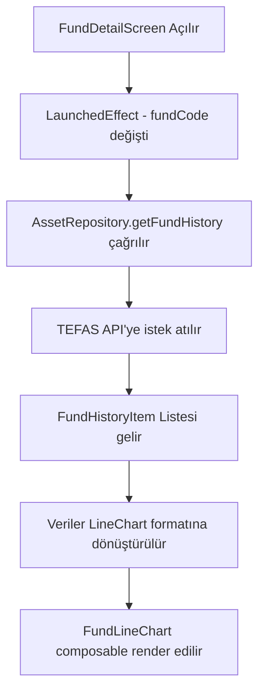

# TEFAS Fund Grafik Entegrasyonu Planı

## Görev Özeti
FundDetailScreen.kt sayfasında TEFAS fon grafiğini göstermek için:
- https://www.tefas.gov.tr/FonAnaliz.aspx?FonKod=DOH (DOH = fon kodu) sayfasındaki verileri kullanarak grafik oluşturma

## Önemli Not
TEFAS web sitesi Highcharts (JavaScript) kullanarak grafik oluşturur. Doğrudan SVG çekmek yerine (JS ile oluşturulduğu için zor), mevcut TEFAS API (`getFundHistory` metodu) kullanılarak ham verileri çekip kendi grafik bileşenimizi oluşturacağız.

---

## Adımlar

### 1. Veri Modeli Oluşturma
- **Dosya:** `app/src/main/java/com/fontakip/data/remote/model/FundHistoryModels.kt`
- **İçerik:** 
  - `FundHistoryItem` - Tarih, fiyat, getiri gibi alanlar
  - `FundHistoryResponse` - API yanıt wrapper

### 2. API Servisini Güncelleme
- **Dosya:** `app/src/main/java/com/fontakip/data/remote/TefasApiService.kt`
- **Değişiklik:** Mevcut `getFundHistory` metodunun yanıt modeli zaten tanımlı, ancak doğru tarih aralığı ile çağrılacak

### 3. Repository Katmanı
- **Dosya:** `app/src/main/java/com/fontakip/domain/repository/AssetRepository.kt` (interface)
- **Dosya:** `app/src/main/java/com/fontakip/data/repository/AssetRepositoryImpl.kt` (implementasyon)
- **Eklenecek:** `suspend fun getFundHistory(fundCode: String, startDate: String, endDate: String): List<FundHistoryItem>`

### 4. Line Chart Bileşeni
- **Dosya:** `app/src/main/java/com/fontakip/presentation/components/FundLineChart.kt`
- **Özellikler:**
  - X ekseni: Tarih
  - Y ekseni: Fiyat/getiri
  - Gradient dolgulu çizgi
  - Touch interaction (opsiyonel)
  - Period selector (1A, 3A, 6A, 1Y, vb.)

### 5. FundDetailScreen Entegrasyonu
- **Dosya:** `app/src/main/java/com/fontakip/presentation/screens/portfolio/FundDetailScreen.kt`
- **Eklenecek:**
  - Grafik verisi state'i
  - API çağrısı (LaunchedEffect ile)
  - LineChart bileşeni

---

## Mermaid Akış Diyagramı

---

## Dosyalar ve Değişiklikler

| Dosya | Değişiklik Türü | Açıklama |
|-------|-----------------|-----------|
| `data/remote/model/FundHistoryModels.kt` | Yeni | Grafik verisi için data class'lar |
| `data/remote/TefasApiService.kt` | Güncelle | getFundHistory çağrısı |
| `domain/repository/AssetRepository.kt` | Güncelle | Interface'e metot ekleme |
| `data/repository/AssetRepositoryImpl.kt` | Güncelle | Implementasyon ekleme |
| `presentation/components/FundLineChart.kt` | Yeni | Line chart bileşeni |
| `presentation/screens/portfolio/FundDetailScreen.kt` | Güncelle | Grafik entegrasyonu |
